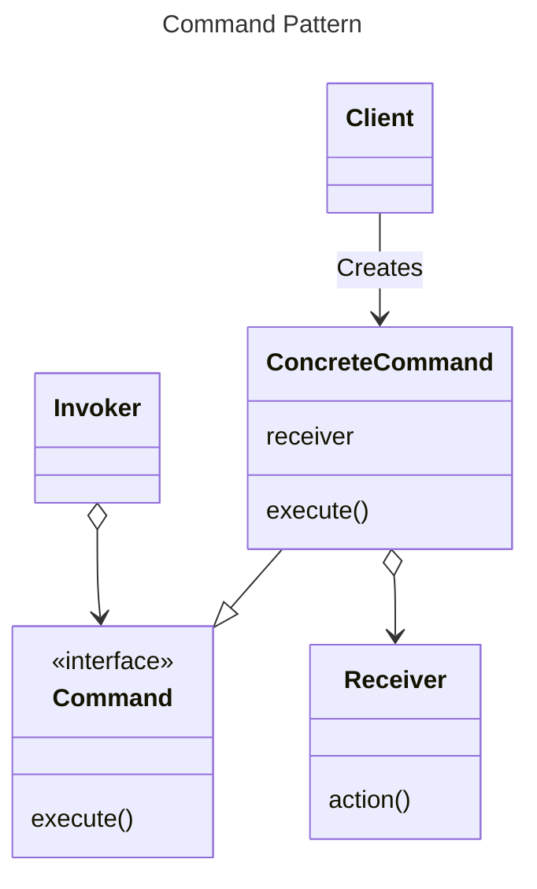
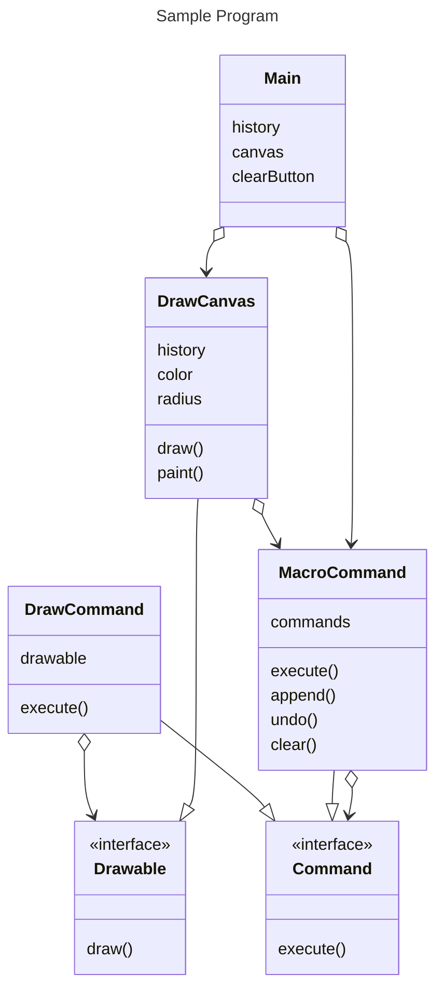
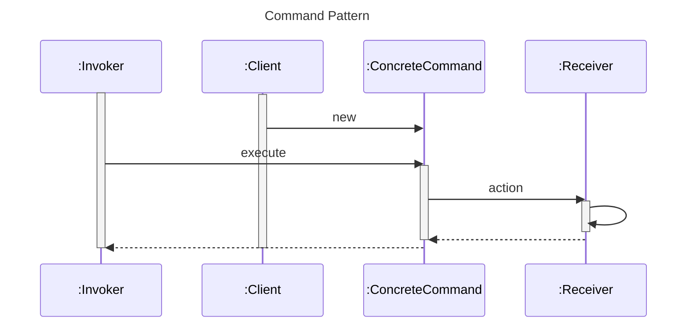
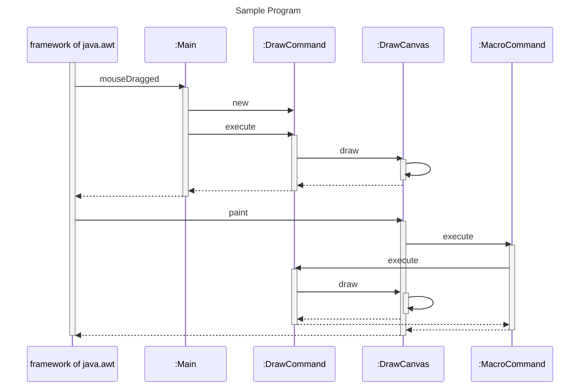

# Command Pattern
- 実装とは切り離して、数え上げを行うことができる

# UML Diagram




# Sequence Diagram



# Windowns11 + WSL2 Ubuntu 20.04 でGUIアプリを起動する
次の作業が必要

### Windowsで動作するXサーバー(VcXsrv)のインストール・セットアップ
参考：
- https://rin-ka.net/windows-x-server/
- https://rin-ka.net/windows-x-server-wsl/

### アプリを実行する前に環境変数「DISPLAY」にnameserverのIPアドレス&ディスプレイ番号をセットする
```
$ export DISPLAY="`grep nameserver /etc/resolv.conf | sed 's/nameserver //'`:0"
```
参考：
- https://rin-ka.net/windows-x-server-wsl/
- http://www.ep.sci.hokudai.ac.jp/~inex/y2017/0630/practical/01_x.html