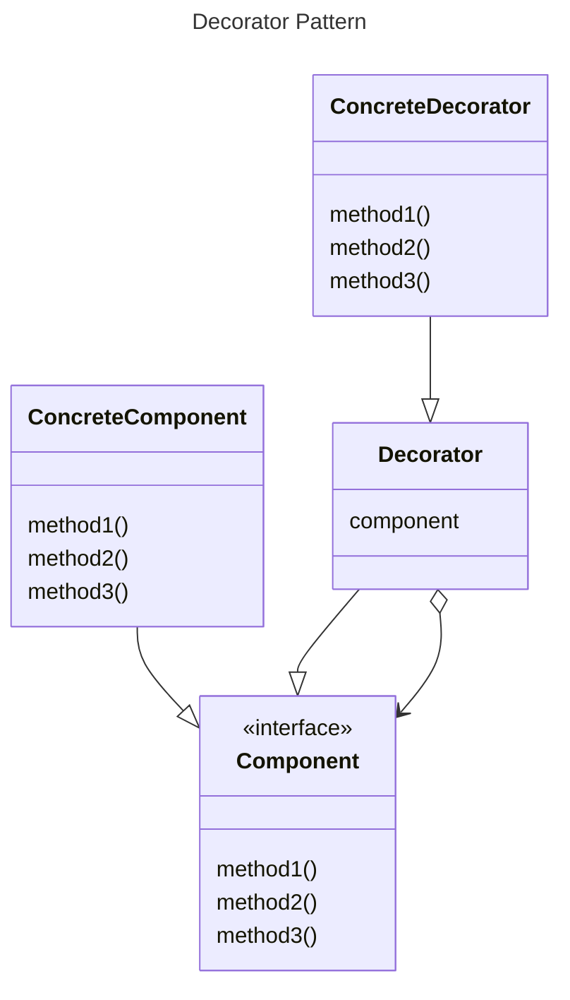
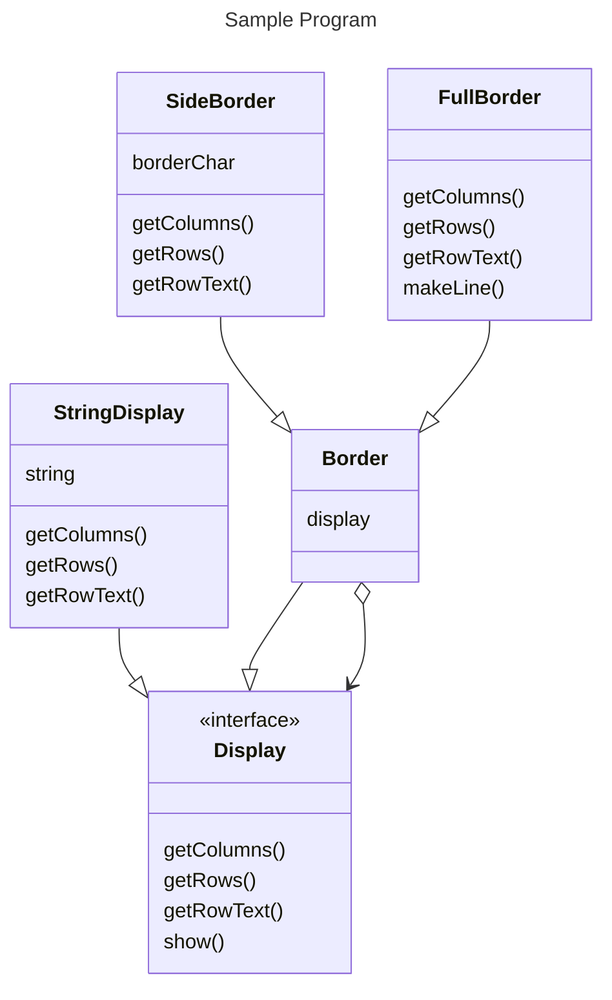

# Decorator Pattern
- 外枠を重ねることで機能を追加していく点に主眼を置く
- 包まれるものを変更することなく、機能の追加を行うことができる
- 使用例：java.ioパッケージのFileReaderやBufferedReaderなど

# UML Diagram

```mermaid
---
title: Decorator Pattern
---
classDiagram
    class Component {
        <<interface>>
        method1()
        method2()
        method3()
    }
    class ConcreteComponent {
        method1()
        method2()
        method3()
    }
    class Decorator {
        component
    }
    class ConcreteDecorator {
        method1()
        method2()
        method3()
    }
    ConcreteComponent --|> Component
    Decorator --|> Component
    Decorator o--> Component
    ConcreteDecorator --|> Decorator
```

```mermaid
---
title: Sample Program
---
classDiagram
    class Display {
        <<interface>>
        getColumns()
        getRows()
        getRowText()
        show()
    }
    class StringDisplay {
        string
        getColumns()
        getRows()
        getRowText()
    }
    class Border {
        display
    }
    class SideBorder {
        borderChar
        getColumns()
        getRows()
        getRowText()
    }
    class FullBorder {
        getColumns()
        getRows()
        getRowText()
        makeLine()
    }
    StringDisplay --|> Display
    Border --|> Display
    Border o--> Display
    SideBorder --|> Border
    FullBorder --|> Border
```