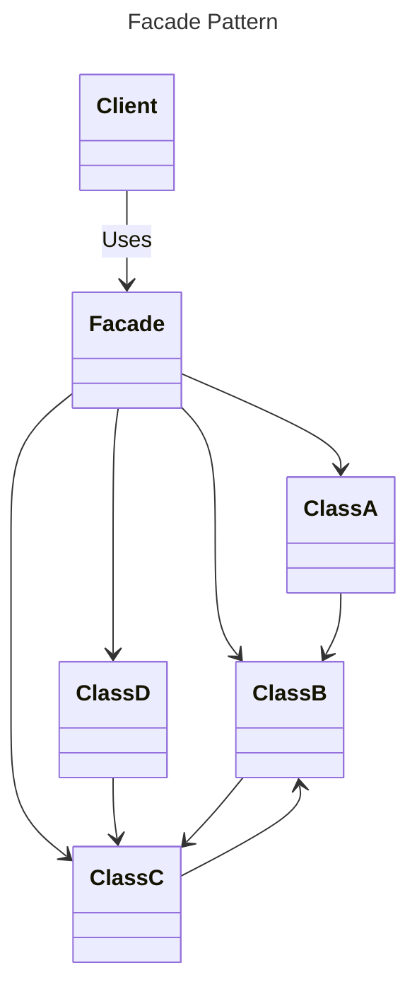
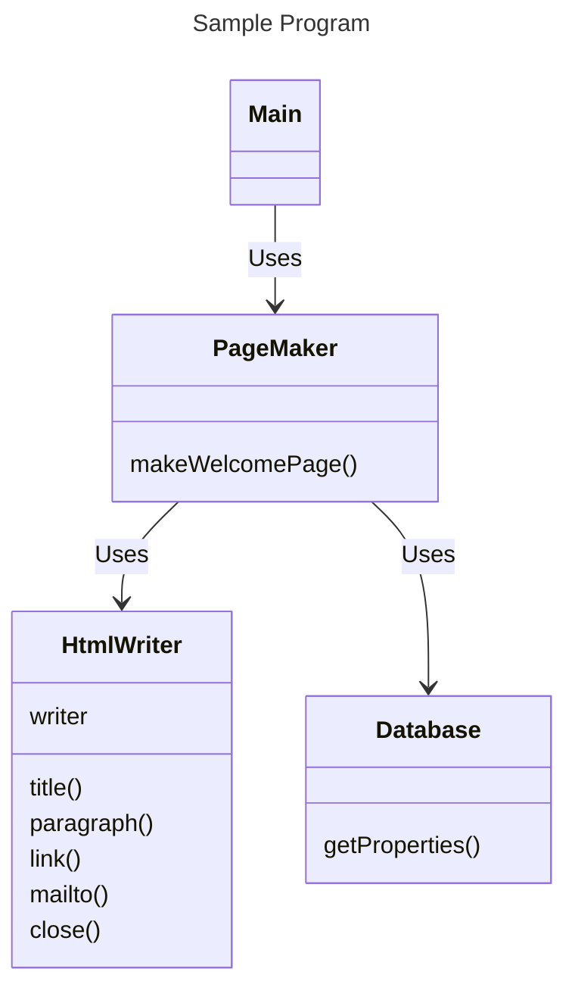

# Facade Pattern
- 複雑なものを単純に見せる
- インターフェース(API)を少なくすることで利便性の向上や、外部との結合を疎にできる

# UML Diagram

```mermaid
---
title: Facade Pattern
---
classDiagram
    class Client {
    }
    class Facade {
    }
    class ClassA {
    }
    class ClassB {
    }
    class ClassC {
    }
    class ClassD {
    }
    Client --> Facade: Uses
    Facade --> ClassA
    Facade --> ClassB
    Facade --> ClassC
    Facade --> ClassD
    ClassA --> ClassB
    ClassD --> ClassC
    ClassB --> ClassC
    ClassC --> ClassB
```

```mermaid
---
title: Sample Program
---
classDiagram
    class Main {
    }
    class PageMaker {
        makeWelcomePage()
    }
    class HtmlWriter {
        writer
        title()
        paragraph()
        link()
        mailto()
        close()
    }
    class Database {
        getProperties()
    }
    Main --> PageMaker: Uses
    PageMaker --> HtmlWriter: Uses
    PageMaker --> Database: Uses
```