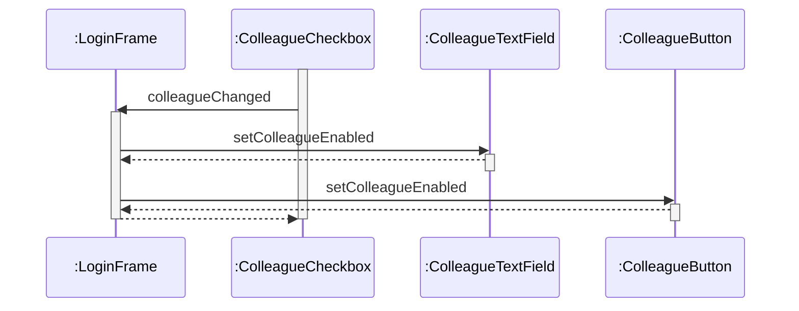

# Mediator Pattern
- 複雑に絡み合うオブジェクト(Colleague)たちの相互の通信をやめ、Mediator役に情報を集中させることによって処理を整理する
- GUIアプリケーションなど、ある要素の変化に連動してほか要素の状態も変化させるようなケースに有効

# UML Diagram
```mermaid
---
title: Mediator Pattern
---
classDiagram
    class Mediator {
        <<interface>>
        createColleagues()
        colleagueChanged()
    }
    class Colleague {
        <<interface>>
        mediator
        setMediator()
        controlColleague()        
    }
    class ConcreteMediator {
        concreteColleague1
        concreteColleague2
        concreteColleague3
        createColleagues()
        colleagueChanged()
    }
    class ConcreteColleague1 {
        controlColleague()
    }
    class ConcreteColleague2 {
        controlColleague()
    }
    class ConcreteColleague3 {
        controlColleague()
    }
    
    Colleague o--> Mediator: 
    ConcreteMediator --|> Mediator: 
    ConcreteMediator o--> ConcreteColleague1: 
    ConcreteMediator o--> ConcreteColleague2: 
    ConcreteMediator o--> ConcreteColleague3: 
    ConcreteColleague1 --|> Colleague: 
    ConcreteColleague2 --|> Colleague: 
    ConcreteColleague3 --|> Colleague: 
```

```mermaid
---
title: Sample Program
---
classDiagram
    class Mediator {
        <<interface>>
        createColleagues()
        colleagueChanged()
    }
    class Colleague {
        <<interface>>
        setMediator()
        setColleagueEnabled()
    }
    class Frame {
    }
    class LoginFrame {
        checkGuest
        checkLogin
        textUser
        textPass
        buttonOk
        buttonCancel
        createColleague()
        colleagueChanged()
        userpassChanged()
        actionPerformed()
    }
    class ColleagueButton {
        mediator
        setMediator()
        setColleagueEnabled()
    }
    class ColleagueTextField {
        mediator
        setMediator()
        setColleagueEnabled()
        textValueChanged()
    }
    class ColleagueCheckbox {
        mediator
        setMediator()
        setColleagueEnabled()
        itemStateChanged()
    }
    class Button {
    }
    class TextField {
    }
    class Checkbox {
    }

    LoginFrame --|> Frame: 
    LoginFrame --|> Mediator: 
    LoginFrame o--> ColleagueButton: 
    LoginFrame o--> ColleagueTextField: 
    LoginFrame o--> ColleagueCheckbox: 
    ColleagueButton ..|> Colleague: 
    ColleagueButton --|> Button: 
    ColleagueButton o--> Mediator: 
    ColleagueTextField ..|> Colleague: 
    ColleagueTextField --|> TextField: 
    ColleagueTextField o--> Mediator: 
    ColleagueCheckbox ..|> Colleague: 
    ColleagueCheckbox --|> Checkbox: 
    ColleagueCheckbox o--> Mediator: 
```

# Sequence Diagram
