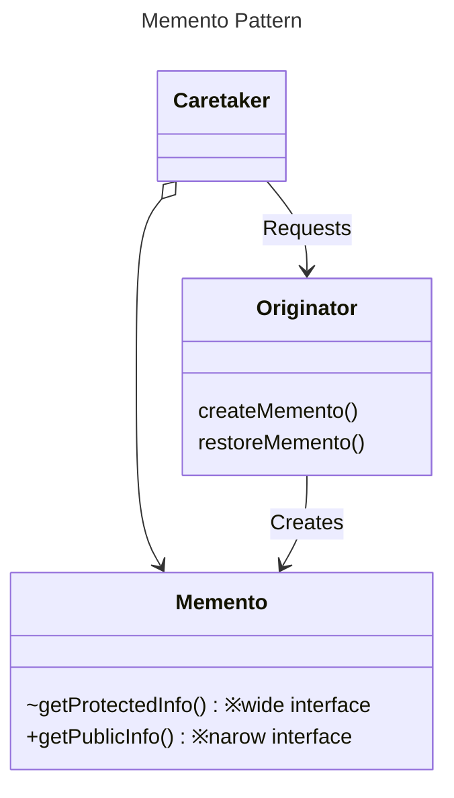
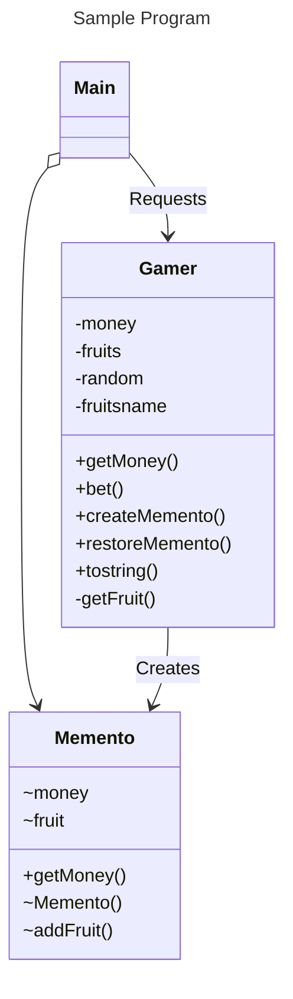
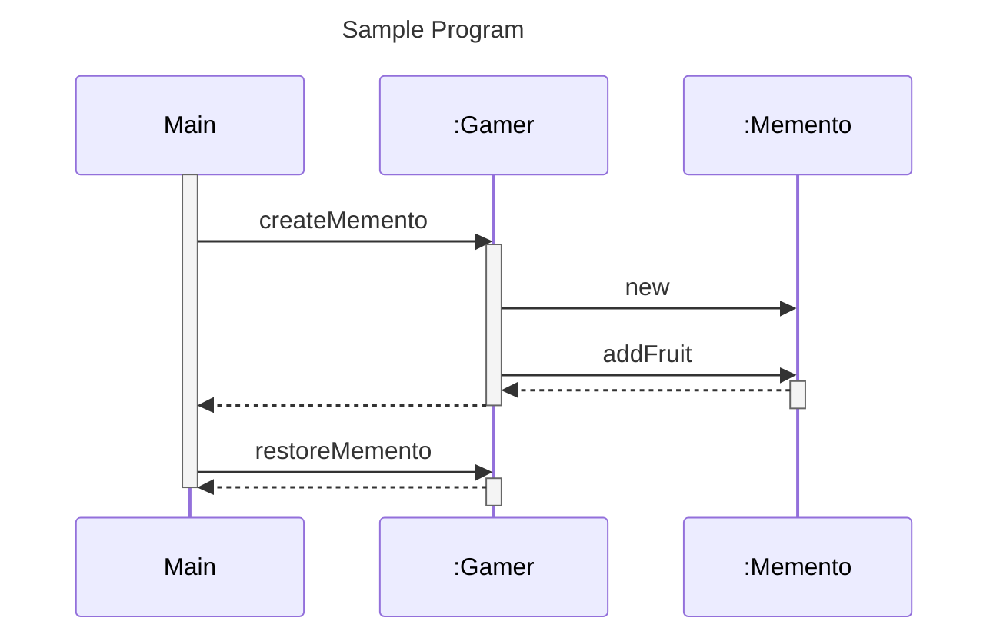

# Memento Pattern
- 現在のオブジェクトの状態を記録し、保存する

# UML Diagram

```mermaid
---
title: Memento Pattern
---
classDiagram
    class Caretaker {
    }
    class Originator {
        createMemento()
        restoreMemento()
    }
    class Memento {
        ~getProtectedInfo() ※wide interface
        +getPublicInfo() ※narow interface
    }

    Caretaker --> Originator: Requests
    Caretaker o--> Memento: 
    Originator --> Memento: Creates
```

```mermaid
---
title: Sample Program
---
classDiagram
    class Main {
    }
    class Gamer {
        -money
        -fruits
        -random
        -fruitsname
        +getMoney()
        +bet()
        +createMemento()
        +restoreMemento()
        +tostring()
        -getFruit()
    }
    class Memento {
        ~money
        ~fruit
        +getMoney()
        ~Memento()
        ~addFruit()
    }

    Main --> Gamer: Requests
    Main o--> Memento: 
    Gamer --> Memento: Creates
```

# Sequence Diagram

```mermaid
---
title: Sample Program
---
sequenceDiagram
    participant Main
    participant Gamer as :Gamer
    participant Memento as :Memento

    activate Main
    Main ->> Gamer: createMemento
    activate Gamer
    Gamer ->> Memento: new
    Gamer ->> Memento: addFruit
    activate Memento
    Memento -->> Gamer: 
    deactivate Memento
    Gamer -->> Main: 
    deactivate Gamer
    Main ->> Gamer: restoreMemento
    activate Gamer
    Gamer -->> Main:  
    deactivate Gamer
    deactivate Main
```