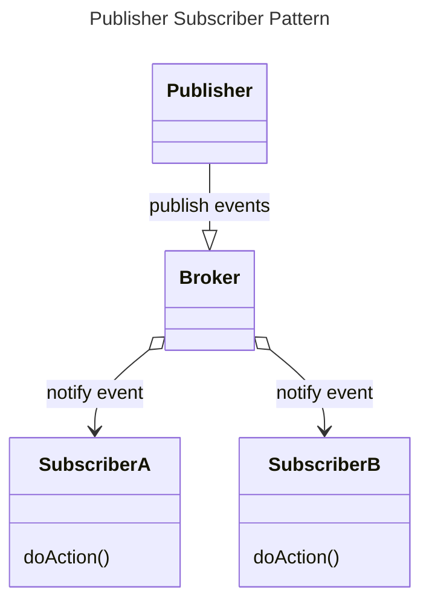
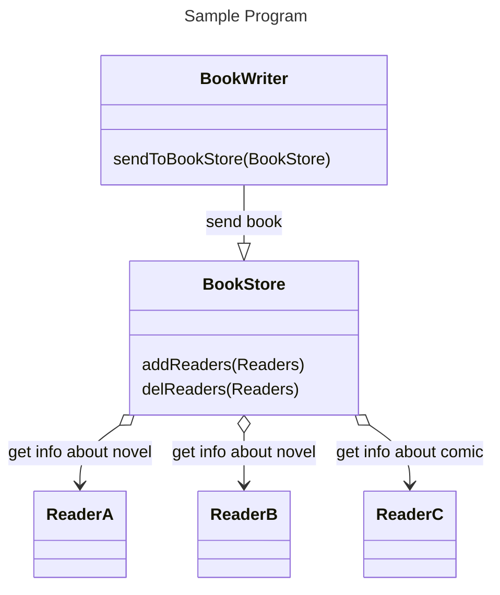

# Publisher Subscriber Pattern
- Publisher: 自分自身で処理した内容をBrokerに通知
- Broker: Publisherから受けた通知を対象となるSubscriberに通知する
- Subscriber: Brokerから知らせを受けて、自分の処理を進める

# UML Diagram

```mermaid
---
title: Publisher Subscriber Pattern
---
classDiagram
    class Publisher {        
    }
    class Broker {        
    }
    class SubscriberA {
        doAction()
    }
    class SubscriberB {
        doAction()
    }
    
    Publisher --|> Broker: publish events
    Broker o--> SubscriberA: notify event
    Broker o--> SubscriberB: notify event
```

```mermaid
---
title: Sample Program
---
classDiagram
    class BookWriter {
        sendToBookStore(BookStore)
    }
    class BookStore {
        addReaders(Readers)
        delReaders(Readers)
    }

    BookWriter --|> BookStore: send book
    BookStore o--> ReaderA: get info about novel
    BookStore o--> ReaderB: get info about novel
    BookStore o--> ReaderC: get info about comic

```
