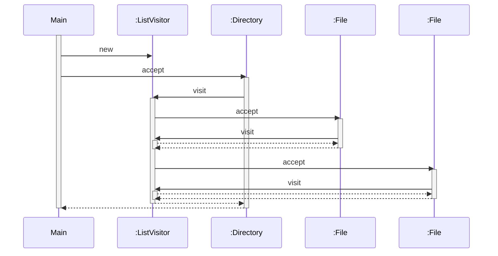

# Visitor Pattern
- データ構造の要素に対する処理を切り出してVisitor役に任せることで、処理をデータ構造から分離する
- 要素(データ構造)の独立性を高める
- OCPを実現している

# UML Diagram
```mermaid
---
title: Visitor Pattern
---
classDiagram
    class Visitor {
        <<abstract>>
        visit(ConcreteElementA)
        visit(ConcreteElementB)
    }
    class ConcreteVisitor {
        visit(ConcreteElementA)
        visit(ConcreteElementB)
    }
    class Element {
        accept(Visitor)
    }
    class ObjectStructure {
    }
    class ConcreteElementA {
        accept(Visitor)
    }
    class ConcreteElementB {
        accept(Visitor)
    }

    ConcreteVisitor --|> Visitor: 
    ConcreteElementA --|> Element: 
    ConcreteElementB --|> Element: 
    ObjectStructure o--> Element: 
```

```mermaid
---
title: Sample Program
---
classDiagram
    class Visitor {
        <<abstract>>
        visit(File)
        visit(Directory)
    }
    class ListVisitor {
        currentdir
        visit(File)
        visit(Directory)
    }
    class Element {
        <<interface>>
        accept(Visitor)
    }
    class Entry {
        <<abstract>>
        getName()
        getSize()
        add()
        iterator()
    }
    class File {
        name
        size
        accept(Visitor)
        getName()
        getSize()
    }
    class Directory {
        name
        dir
        accept(Visitor)
        getName()
        getSize()
        add()
        iterator()
    }
    class Main {
    }

    ListVisitor --|> Visitor: 
    Main --> ListVisitor: Uses
    Main --> File: Uses
    Main --> Directory: Uses
    Entry --|> Element: 
    File --|> Entry: 
    Directory --|> Entry: 
    Directory o--> Entry: 
```

# Sequence Diagram
